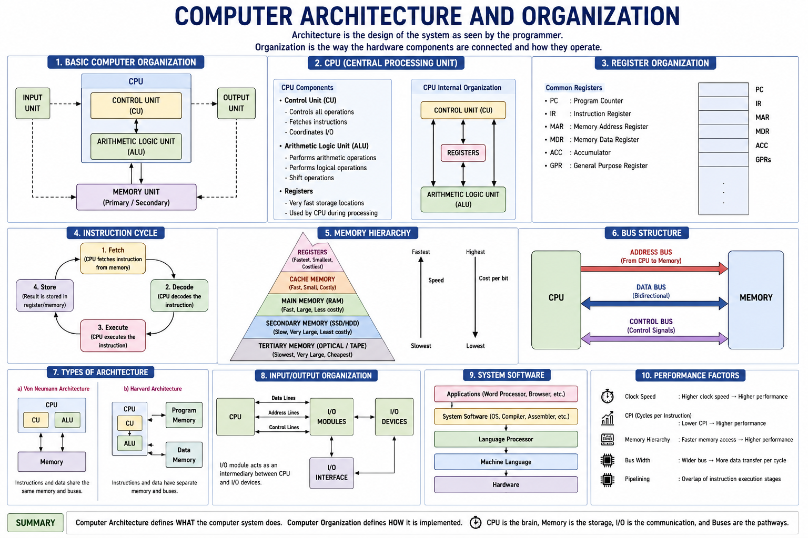
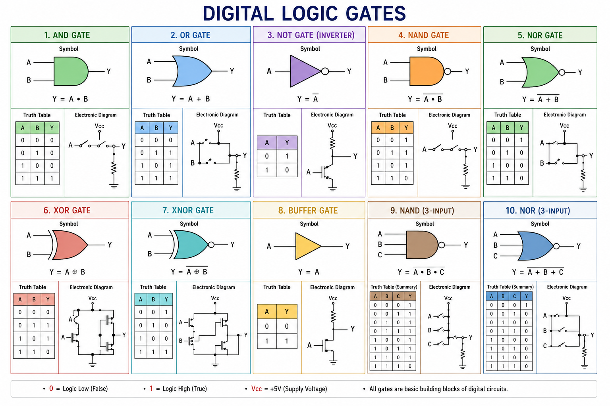

# Computer_Organization_-_Architecture
Computer Organization &amp; Architecture

<div align="center">

<!-- Replace with your banner image -->




### 📚 Complete Notes • VHDL Programs • ModelSim • Digital Logic • Diagrams • Practical Experiments

</div>

---

## 📖 About

This repository contains comprehensive study materials for **Computer Architecture & Organization (CAO)**. It is designed for **B.Tech Computer Science & Engineering students**, covering theory, practical implementations, digital logic design, VHDL programming, ModelSim simulations, CPU architecture, memory organization, and exam preparation.

---

## 🖼 Repository Preview

<p align="center">

</p>

---

# 📚 Contents

- Digital Logic Gates
- Boolean Algebra
- Number Systems
- K-Map Simplification
- Combinational Circuits
- Sequential Circuits
- CPU Organization
- Register Organization
- Instruction Cycle
- Memory Hierarchy
- Cache Memory
- Bus Architecture
- Input Output Organization
- Control Unit
- Pipeline Processing
- RISC vs CISC
- VHDL Programs
- ModelSim Simulations
- Laboratory Experiments
- Previous Year Questions

---

# 🏗 Computer Organization

<p align="center">

</p>

---

# 🖥 CPU Architecture

<p align="center">

</p>

---

# 💾 Memory Hierarchy

<p align="center">

</p>

---

# 🔄 Instruction Cycle

<p align="center">

</p>

---

# 🚌 Bus Structure

<p align="center">

</p>

---

# ⚙ Digital Logic Gates

<p align="center">

</p>

---

# 🧮 Truth Tables

<p align="center">

</p>

---

# 🔬 ModelSim Simulation

<p align="center">

</p>

---

# 💻 VHDL Programs Included

- AND Gate
- OR Gate
- NOT Gate
- NAND Gate
- NOR Gate
- XOR Gate
- XNOR Gate
- Half Adder
- Full Adder
- Half Subtractor
- Full Subtractor
- Multiplexer
- Demultiplexer
- Encoder
- Decoder
- Flip-Flops
- Counters
- Shift Registers

---

# 📂 Project Structure

```text
Computer-Architecture-and-Organization
│
├── Notes/
├── Diagrams/
├── Images/
├── VHDL/
│   ├── AND Gate
│   ├── OR Gate
│   ├── NOT Gate
│   ├── NAND Gate
│   ├── NOR Gate
│   ├── XOR Gate
│   └── XNOR Gate
│
├── ModelSim/
├── Experiments/
├── PDFs/
└── README.md
```

---

# 🛠 Software Used

- ModelSim
- Quartus Prime
- Visual Studio Code
- Git
- GitHub

---

# 📚 Topics Covered

- Computer Architecture
- Computer Organization
- CPU
- ALU
- Control Unit
- Registers
- Memory Hierarchy
- Cache
- Main Memory
- Secondary Memory
- Bus Organization
- Instruction Cycle
- Pipelining
- Addressing Modes
- VHDL
- Digital Logic Design

---

# 📸 Screenshots

| Architecture | Logic Gates |
|--------------|-------------|
|  |  |

---

| Memory | CPU |
|---------|-----|
|  |  |

---

# ⭐ Repository Features

- 📖 Comprehensive Notes
- 🖼 High Quality Diagrams
- 💻 VHDL Source Code
- ⚡ ModelSim Simulations
- 📊 Truth Tables
- 📝 Lab Programs
- 🎯 Exam Preparation
- 🚀 Interview Revision

---

# 🤝 Contributions

Contributions are welcome! Feel free to fork this repository, create a new branch, and submit a pull request to improve the content.

---

# 📜 License

This project is licensed under the MIT License.

---

<div align="center">

### ⭐ If this repository helped you, don't forget to Star it!

Made with ❤️ for Computer Science Students

</div>
